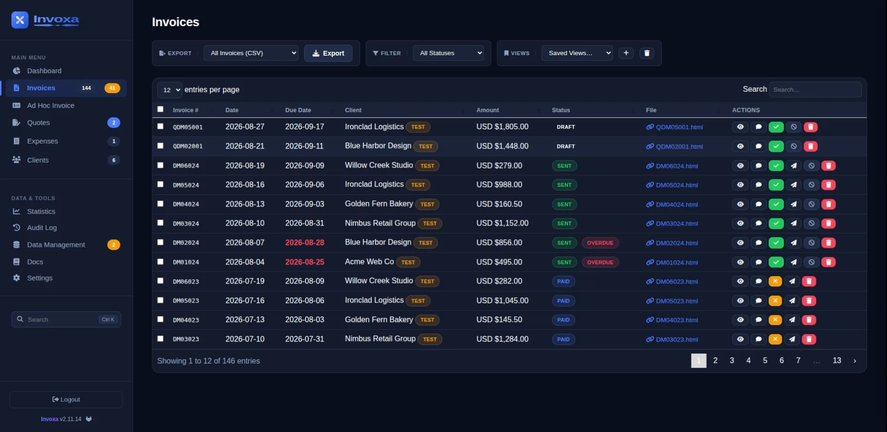
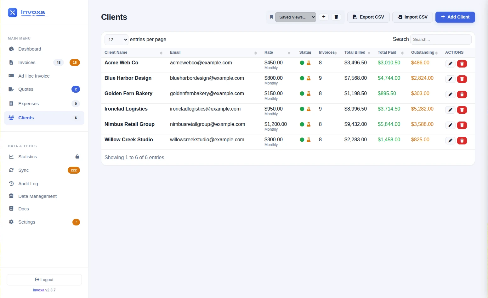
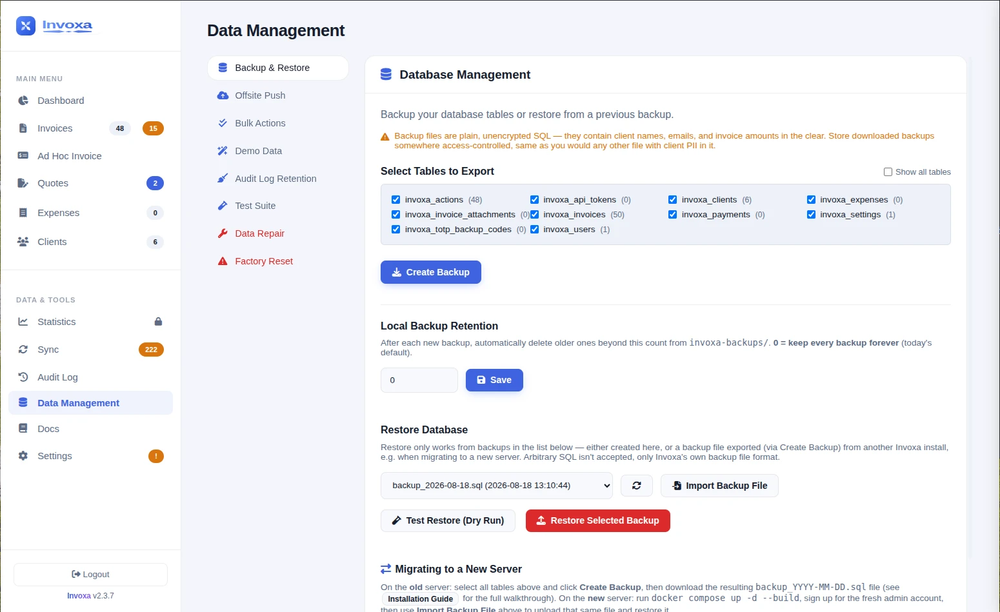
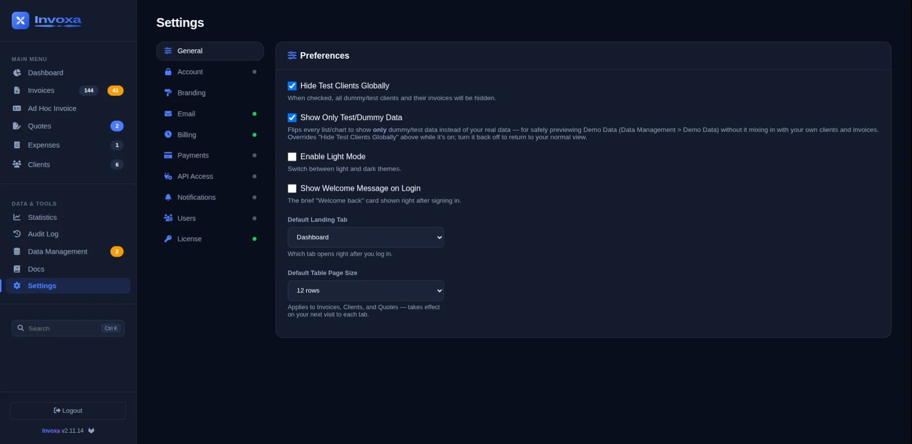
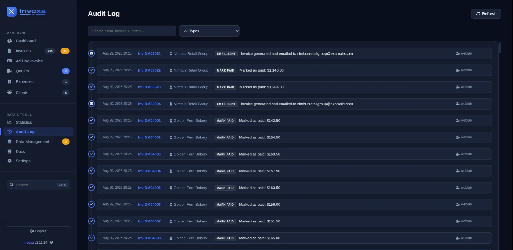
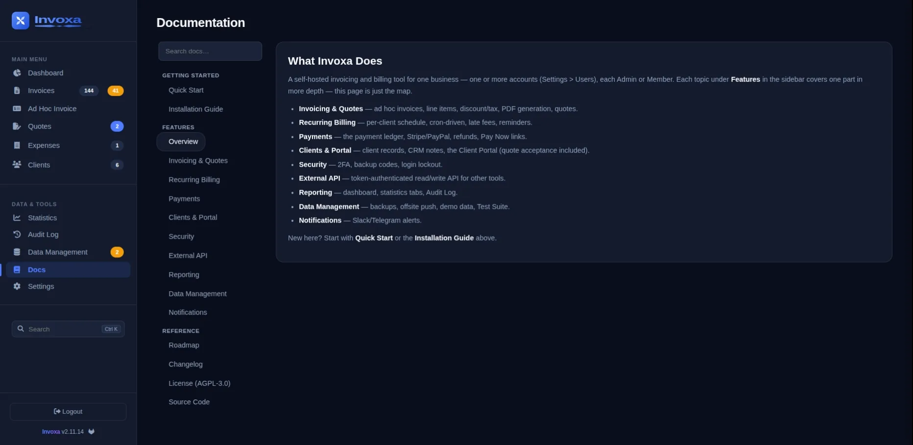

# Invoxa

Self-hosted invoicing & recurring billing for agencies — manage your clients, generate and email invoices, track payments, and run monthly recurring billing automatically. Free and open source (AGPL-3.0, see [LICENSE](LICENSE)).

One admin account, unlimited clients, brandable invoices (your logo, colors, footer text), CSV/tax-year reporting, database backup & restore, and a monthly billing cron — all in one `docker compose up`.

## Screenshots

| Dashboard | Invoices |
|---|---|
|  |  |

| Ad Hoc Invoice | Clients |
|---|---|
|  |  |

| Data Management | Settings |
|---|---|
|  |  |

| Audit Log | Documentation |
|---|---|
|  |  |

See **[INSTALL.md](INSTALL.md)** for setup (including email/SMTP configuration).

## Quick start

```bash
docker compose up -d --build
```

That's it — no `.env` file required. Open `http://<this-server>:8090` and create your admin account on first run.

Sending real invoice emails needs SMTP configured, though (there's no working default for that). Copy `.env.example` to `.env`, fill in the SMTP section (a Gmail walkthrough is in [INSTALL.md](INSTALL.md)), and re-run `docker compose up -d --build`.

## Licensing

Invoxa is free and open source — everything above works with no license key at all. A paid license is an optional unlock for six extras: Stripe/PayPal payment collection, recurring billing automation, the Client Portal, the external API, Reporting & Statistics, and removing the "Powered by Invoxa" credit from invoices and emails. Add a key under the **License** tab if you want those; the rest of the app is unaffected either way.

## Migrating or locked out?

See [INSTALL.md](INSTALL.md#migrating-to-a-new-server) for moving Invoxa to a new server, or [INSTALL.md](INSTALL.md#recovering-access-forgot-adminusernamepassword) if you've forgotten the admin login.
