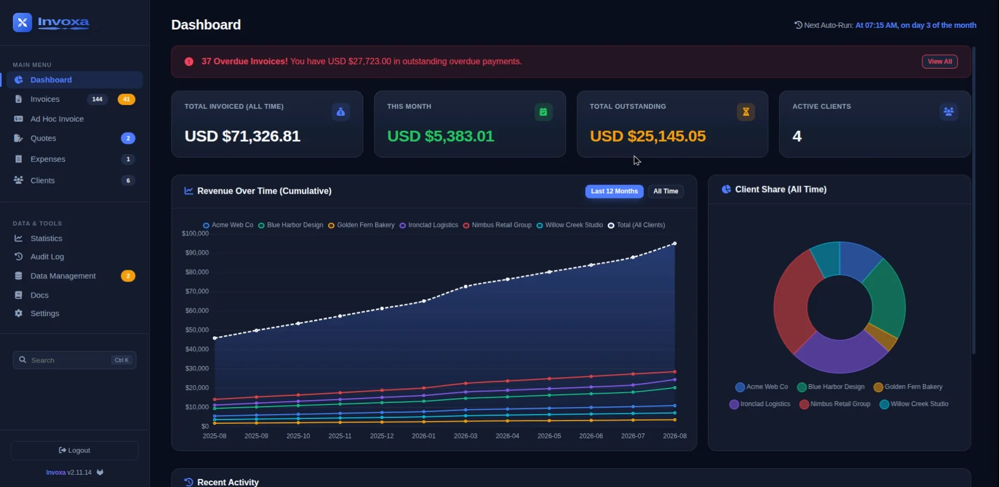
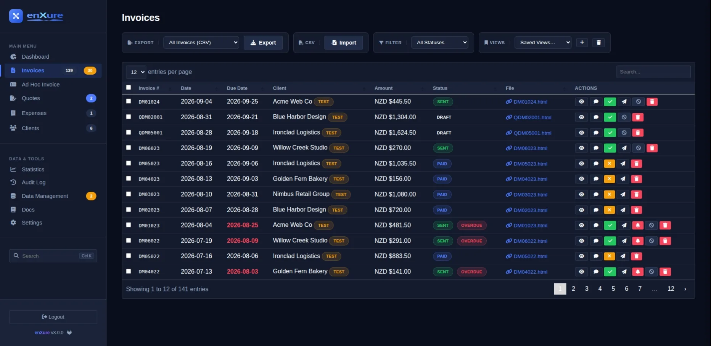
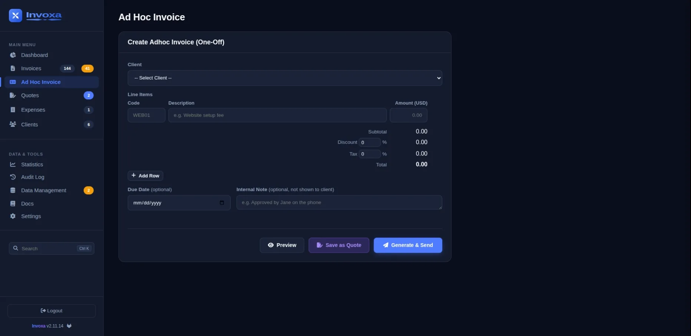
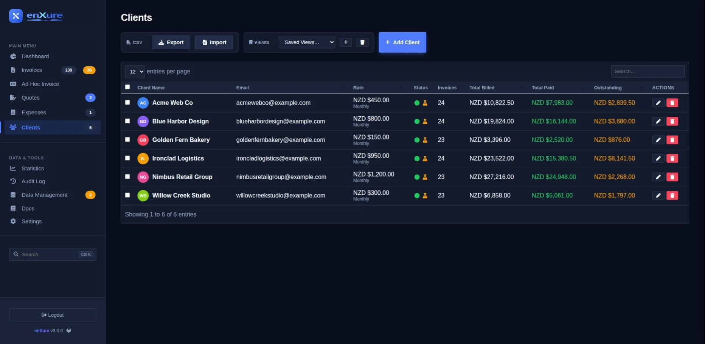
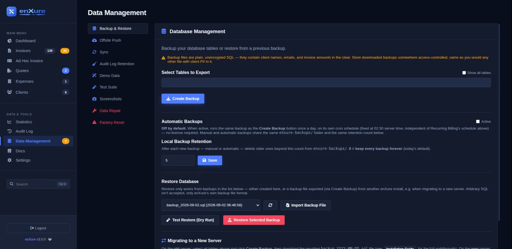
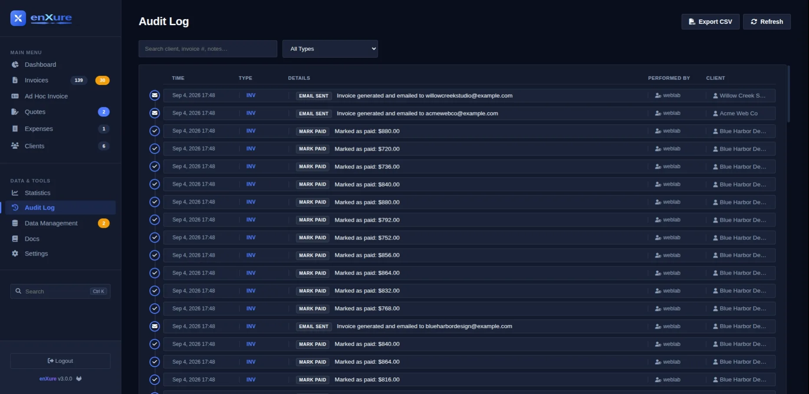
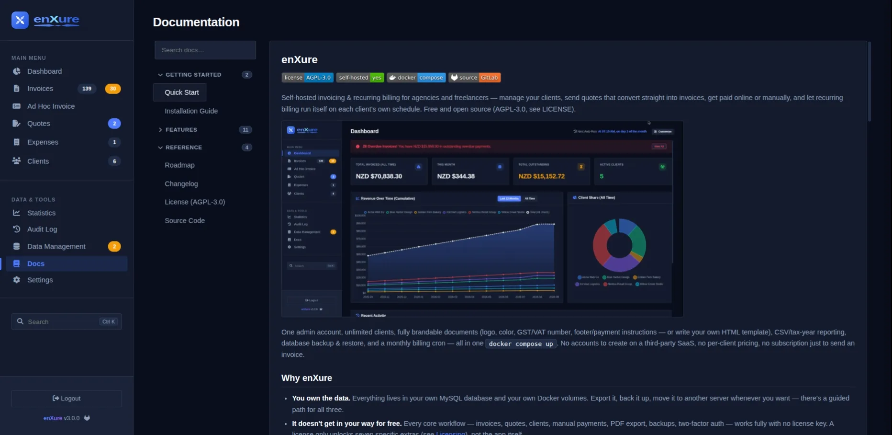

# enXure


[](https://gitlab.com/weblabnz/enxure)

Self-hosted invoicing & recurring billing for agencies and freelancers — manage your clients, send quotes that convert straight into invoices, get paid online or manually, and let recurring billing run itself on each client's own schedule. Free and open source (AGPL-3.0, see [LICENSE](LICENSE)).



One admin account, unlimited clients, fully brandable documents (logo, color, GST/VAT number, footer/payment instructions — or write your own HTML template), CSV/tax-year reporting, database backup & restore, and a monthly billing cron — all in one `docker compose up`. No accounts to create on a third-party SaaS, no per-client pricing, no subscription just to send an invoice.

## Why enXure

- **You own the data.** Everything lives in your own MySQL database and your own Docker volumes. Export it, back it up, move it to another server whenever you want — there's a guided path for all three.
- **It doesn't get in your way for free.** Every core workflow — invoices, quotes, clients, manual payments, PDF export, backups, two-factor auth — works fully with no license key. A license only unlocks seven specific extras (see [Licensing](#licensing)), not the app itself.
- **It looks like your business, not like enXure.** Logo, brand color, GST/VAT number, footer/payment instructions, and — if the built-in Detailed/Compact layouts aren't quite right — a small template language to write your own invoice HTML from scratch, with a live preview before you commit to it.
- **It's one container stack, not a platform.** PHP + MySQL + nginx, no Node build step, no external services required to get a first invoice out the door.

## Feature tour

### Invoicing & quotes
- Create invoices and one-off quotes; convert a quote to a real invoice with a single click once the client accepts.
- Multiple line items per document, plus an invoice-level discount % and tax %, with the subtotal/discount/tax/total breakdown computed and shown automatically.
- Configurable invoice numbering (your own prefix/sequence template and zero-padding).
- Clean PDF export for every invoice and quote — download from the browser or attach automatically to the outgoing email.
- Three ways to lay it out: **Detailed** (spacious default), **Compact** (fits more line items per page), or **Custom** — enXure ships a small nunjucks-style template engine (variables, `` conditionals, `` loops over line items) so you can restyle the HTML that becomes your PDF from the ground up, with a one-click sample preview to check it before saving.
- Full client contact details on file and on the document — name, email, phone, address, plus your own GST/VAT number on every invoice and quote.

### Recurring billing & payments
- Per-client billing frequency (weekly / monthly / quarterly / annually), payment terms, and default discount/tax.
- A cron-driven recurring run generates and emails that period's invoices automatically — no manual "did I bill everyone this month?" checklist. *(license required)*
- Optional late-fee and payment-reminder automation on top of the recurring schedule. *(license required)*
- Stripe and PayPal Checkout for online payment collection, with webhook-verified payments and refunds posting back to the invoice automatically — or just record a payment manually if a client pays by bank transfer or cheque. *(online collection requires a license; manual payment recording is always free)*

### Clients & client portal
- Unlimited clients, with CSV export and import for bulk onboarding or migrating off a spreadsheet.
- Per-client rate, billing frequency, payment terms, discount/tax, bank details, phone, and address, plus a running total of billed / paid / outstanding right in the client list.
- An optional **Client Portal** link — a token-gated page where a client sees their own invoices and payment status, and can accept an open quote in one click (which converts it to a real invoice and notifies you), with no login of their own required. You control when the link is generated, and it can be set to expire. *(license required to generate/regenerate; revoking a link is always free)*

### Branding, made to look like you
- Logo, primary brand color, business name, GST/VAT number, and footer/payment instructions all show up consistently across invoices, quotes, and outgoing email.
- Remove the "Powered by enXure" credit line entirely if you want a fully white-labelled document. *(license required)*

### Security & account recovery
- Single admin account with optional TOTP two-factor authentication and one-time backup codes for when you lose your authenticator.
- Login lockout after repeated failed attempts.
- Email confirmation on signup and a password-reset flow (one-time emailed link, 30-minute expiry) so account recovery never depends on remembering a secret you never wrote down — and never leaks whether a given email is registered.

### Reporting, audit & data integrity
- A six-tab Reporting & Statistics view — revenue, forecasting, per-client breakdowns, tax & compliance, activity, and system health. *(license required — but browsable unlicensed so you can see what you'd be unlocking)*
- A full, searchable audit log of every invoice and quote action: sent, paid, voided, and more, with a timestamp and the client attached.
- One-click database backups with a choice of which tables to include, configurable local retention, and an optional offsite push.
- Dry-run restores before you commit, plus a guided walkthrough for migrating the whole install to a new server.
- A filesystem sync check reconciles the on-disk invoice/quote HTML files against the database, so a restored backup or a manually-touched file never silently drifts out of sync.
- **Demo Data** mode populates the app with realistic sample clients and invoices so you can try every feature risk-free, and **Factory Reset** wipes everything and returns to a clean first-run state.

### Integrations
- A token-authenticated external REST API — list invoices and clients, and record payments, from your own scripts or a mobile/desktop client. *(license required)*
- Slack and Telegram notifications when a payment comes in or an invoice goes overdue.

## Screenshots

| | |
|---|---|
| <br>**Invoices** — every invoice and quote in one sortable, filterable table: status badges, saved views, per-row preview/comment/send/void/delete actions, and CSV export. | <br>**Ad Hoc Invoice** — build a one-off invoice or quote in seconds: line items, discount/tax, an optional due-date override, preview before sending, and *Save as Quote* instead of *Generate & Send* when you're not ready to bill yet. |
| <br>**Clients** — every client's rate, billing frequency, invoice count, and running total billed/paid/outstanding, with CSV export/import for bulk management. | <br>**Settings** — general preferences, branding, email, billing, payments, API access, notifications, and license in one place, with paid features clearly marked instead of just disappearing. |
| <br>**Data Management** — pick which tables to back up, set local retention, push offsite, dry-run a restore, or follow the guided server-migration path. | <br>**Audit Log** — every invoice action, timestamped and searchable, so you can always answer "what happened to this invoice." |

<details>
<summary>Built-in documentation</summary>



A full docs site ships inside the app itself — searchable, covering setup, every feature above in more depth, and the external API reference — so help is never more than one click away from wherever you're stuck.

</details>

See **[INSTALL.md](INSTALL.md)** for setup (including email/SMTP configuration).

## Quick start

```bash
docker compose up -d --build
```

That's it — no `.env` file required. Open `http://<this-server>:8090` and create your admin account on first run.

Sending real invoice emails needs SMTP configured, though (there's no working default for that). Copy `.env.example` to `.env`, fill in the SMTP section (a Gmail walkthrough is in [INSTALL.md](INSTALL.md)), and re-run `docker compose up -d --build`.

## Licensing

enXure is free and open source — everything above works with no license key at all. A paid license is an optional unlock for seven extras: Stripe/PayPal payment collection, recurring billing automation, the Client Portal, the external API, adding teammates beyond your own account (Settings > Users), Reporting & Statistics, and removing the "Powered by enXure" credit from invoices and emails. [Buy a license](https://polar.sh/checkout/polar_c_9NP0xraIuDX2CVOhpCMXiO0YA4oXQZq3olpjr2xWyZU) and add the key under the **License** tab if you want those; the rest of the app is unaffected either way.

## Support

Questions, bug reports, or feature requests: [open an issue on GitLab](https://gitlab.com/weblabnz/enxure/-/issues), or email `contact-project+weblabnz-enxure-inv@incoming.gitlab.com` if you'd rather not create a GitLab account — it lands in the same place either way.

## Contributing

Development happens on [GitLab](https://gitlab.com/weblabnz/enxure) — merge requests, issues, and discussion all live there. The GitHub mirror is read-only; pull requests opened there are closed automatically with a link back to GitLab.

## Migrating or locked out?

See [INSTALL.md](INSTALL.md#migrating-to-a-new-server) for moving enXure to a new server, or its [Recovering access](INSTALL.md#recovering-access-forgot-admin-usernamepassword) section if you've forgotten the admin login.
